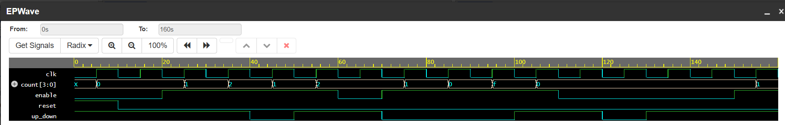

# 4-bit-Counter-Verilog
A synthesizable 4-bit binary counter designed using Verilog. Includes a testbench for functional verification and waveform analysis
## Files
- `counter.v`: RTL design code.
- `counter_tb.v`: Testbench to verify functionality.

## Verification
- Simulator: EDA Playground / Icarus Verilog.
- The design was verified by checking the count output incrementing from 0 to 15.

## How to run
1. Clone this repository.
2. Run the simulation using `iverilog counter.v counter_tb.v && vvp a.out`.
3. Open the generated VCD file in GTKWave to view the waveform.

## Simulation Waveform

